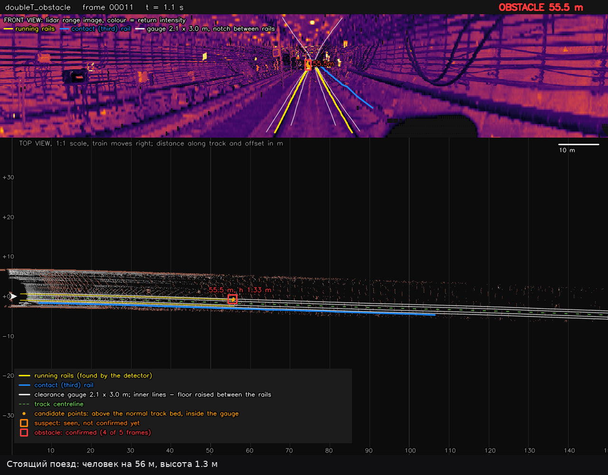

# Система обнаружения посторонних объектов для беспилотных поездов в тоннеле метро по данным 3D-лидара

Команда **Attention Please** (Пермь): Белоусов Артём, Белоусова Надежда · belousov.arts@yandex.ru

По облаку лидара система находит путь и габарит поезда и в каждом кадре сообщает:
**СВОБОДНО**, **ВНИМАНИЕ**, **ПРЕПЯТСТВИЕ** (расстояние и список объектов) или **НЕ ГОТОВ**
(путь ещё не найден). Габарит проверяется до 150 м.



Подробно, с обоснованием решений: [REPORT.md](REPORT.md) ([PDF](REPORT.pdf)), презентация —
[PRESENTATION.pptx](PRESENTATION.pptx).

## Быстрый старт

Нужны Docker и видеокарта NVIDIA (драйвер ≥ 570,
[nvidia-container-toolkit](https://docs.nvidia.com/datacenter/cloud-native/container-toolkit/latest/install-guide.html)).
Образ соберётся сам при первом запуске (один раз, ~10 минут, ~13 ГБ).

```bash
./run_bag.sh   /путь/к/бэгу    # прогнать бэг → results/<имя бэга>/: видео, CSV, итог
./run_tool.sh rerun /путь/к/бэгу    # 3D-просмотр в браузере (откроется сам: http://localhost:9090)
./run_live.sh  /путь/к/бэгу    # живой режим: бэг по кругу, детектор и RViz
```

**Бэг** — запись ROS 2: папка с файлом `metadata.yaml` и файлом `.db3` или `.mcap`. Указывать
можно папку или сам файл `.db3` / `.mcap`.

**Топик** указывать не нужно. Топик — имя канала ROS 2, по которому идёт облако лидара
(например `/lidar_points`). Система сама берёт первое облако точек (`PointCloud2`) в бэге. Задать
вручную нужно, только если облаков в бэге несколько: `--topic /имя`. Посмотреть топики бэга
(если на компьютере стоит ROS 2): `ros2 bag info /путь/к/бэгу`.

### Windows

Работает через WSL2 (Windows 10/11):

1. Установить [Docker Desktop](https://docs.docker.com/desktop/setup/install/windows-install/)
   с WSL2 и драйвер NVIDIA для Windows.
2. Открыть терминал **Ubuntu** (WSL), скачать репозиторий там: `git clone …`.
3. Запускать те же команды в терминале Ubuntu (не в PowerShell). Бэги с диска C: доступны как
   `/mnt/c/Users/<имя>/…`.

RViz на Windows 11 открывается сам (WSLg), браузер для rerun — обычный браузер Windows.

## Что на выходе

`./run_bag.sh` пишет в `results/<имя бэга>/`:

| Файл | Что внутри |
|---|---|
| `video.mp4` | сверху развёртка лидара с рельсами, габаритом и препятствиями, снизу вид сверху, внизу скорость и препятствия |
| `detections.csv` | по кадру: статус, расстояние до ближайшего препятствия, докуда виден путь, скорость |
| `obstacles.csv` | подтверждённые препятствия: расстояние, смещение от оси, высота, координаты |
| `summary.json` | итог: сколько кадров в каком статусе, каждое препятствие, время на кадр |

Без видео (быстрее): `./run_bag.sh /путь/к/бэгу --no-video`. Кусок бэга: `--start 20 --until 80`
(секунды).

## Ещё инструменты

| Команда | Что делает |
|---|---|
| `./run_tool.sh map /путь/к/бэгу` | карта: облако `map.ply`, вид сверху, плитки по 100 м |
| `./run_tool.sh stand /путь/к/бэгу --object person@80 --video` | вставить в бэг объект (здесь человека в 80 м) и узнать, с какого расстояния он обнаружен |
| `./run_tool.sh stand --list` | какие объекты можно вставить |
| `./run_tool.sh rerun /путь/к/бэгу --save run.rrd` | 3D-просмотр в файл `results/<имя бэга>/run.rrd`; открыть: `rerun results/<имя бэга>/run.rrd` (нужен `pip install rerun-sdk==0.22.1`) |

## На поезде

Детектор как служба: запускается при загрузке и перезапускается при сбое.

```bash
docker compose up -d --build     # собрать и запустить
docker compose logs -f fod       # журнал
```

Параметры — в `config/train.yaml`: топик лидара (если не задан — первый найденный), установка
лидара, видеокарта. После правки: `docker compose restart fod`.

- **Домен ROS 2** — как у драйвера лидара: `ROS_DOMAIN_ID=5 docker compose up -d`.
- **Пользователь** — тот же, что у драйвера лидара (по умолчанию root). Если драйвер запущен
  от вас: `FOD_UID=$(id -u) FOD_GID=$(id -g) docker compose up -d`. Иначе облака (десятки МБ)
  не проходят через общую память.
- **Установка лидара**: по умолчанию вперёд смотрит ось −y, вверх +z (как в бэгах хакатона).
  Иначе — `forward`, `up`, `rpy` в `config/train.yaml`.

Узел публикует:

- `/fod/status` — JSON: статус, расстояние, препятствия, докуда виден путь, скорость,
  рекомендуемая скорость, тормозной путь;
- `/fod/obstacles` — облако `PointCloud2`, точка на объект (`distance`, `offset`, `height`,
  `track_id`, `confirmed`). Пустое — путь свободен;
- `/fod/markers` — ось, габарит и объекты для RViz.

Если узел не успевает за лидаром, он берёт самый свежий кадр: отставание не копится.

## Как это работает

1. **Одометрия** — своя: сдвиг текстуры стен тоннеля между кадрами, затем уточнение small_gicp.
2. **Рельсы вблизи** — своя нейросеть по развёртке лидара и шаблон пары головок.
3. **Путь вдали** — контактный рельс, профиль тоннеля и вторая нейросеть по накопленному виду
   сверху; ось хранится в мировых координатах.
4. **Габарит 2,1 × 3 м и норма полотна**: всё, что выше нормы внутри габарита и держится
   4 кадра из 5, — препятствие.

## Результаты

Объекты вставлены по лучам лидара в настоящие бэги, поезд подъезжает к ним (медианы по
11 подъездам на объект).

| Что | Результат |
|---|---|
| Человек на пути | ВНИМАНИЕ с 137 м, подтверждён со 114 м |
| Щит 2 × 1,9 м | подтверждён со 129 м |
| Ящик 0,5 м / куб 0,3 м | подтверждены с 85 м / с 70 м |
| Ложные тревоги на чистых бэгах | 0 за 22 минуты |
| Настоящие человек и предмет 16 см на рельсе (`doubleT_obstacle`) | оба подтверждены на 56 м |

Время на кадр: 75–90 мс на RTX 5080 Laptop (лидар — 10 кадров в секунду).

## Ограничения

- Габарит ±1,05 м от оси: предметы у стены и на краю платформы не проверяются.
- Сети обучены на тоннелях из этих бэгов; где они не уверены, путь проверяется ближе.
- Плоские предметы ниже 6 см над головками, лежащие между рельсами, не проверяются —
  так отсекаются таблички и крепления на полотне.
