# Система обнаружения посторонних объектов для беспилотных поездов в тоннеле метро по данным 3D-лидара

**Отчёт о решении.** Команда **Attention Please**, Пермь:
Белоусов Артём (RND-инженер), Белоусова Надежда (системный аналитик).
Контакты: belousov.arts@yandex.ru

## Коротко

По облаку лидара Hesai Pandar128 система в каждом кадре находит путь и габарит поезда и
проверяет, нет ли в габарите посторонних предметов. Для каждого кадра она выдаёт статус
**СВОБОДНО / ВНИМАНИЕ / ПРЕПЯТСТВИЕ / НЕ ГОТОВ**, список объектов (расстояние, смещение от оси,
высота) и рекомендуемую скорость, при которой поезд успеет остановиться.

| Показатель | Значение |
|---|---|
| Дальность проверки габарита | до **150 м**; в медиане путь известен до 154 м |
| Человек на пути | ВНИМАНИЕ с 137 м, подтверждён с **114 м** (медианы по подъездам) |
| Щит 2 × 1,9 м | ВНИМАНИЕ с 149 м, подтверждён с **129 м** |
| Ящик 0,5 м / куб 0,3 м | подтверждены с 85 м / с 70 м |
| Ложные тревоги на чистых записях | **0** за 22 минуты (все короткие записи и 20 минут `new_data`) |
| Время на кадр | **75–90 мс** (лидар даёт 10 Гц, то есть 100 мс на кадр) |
| Поставка | узел ROS 2, Docker, запуск в 3 команды; инструменты: видео, карта, стенд препятствий |

Решение не распознаёт «все возможные предметы». Оно точно строит, где проходит путь, и
тревожит на всё, что поднимается над нормальным полотном внутри габарита и держится
несколько кадров. Поэтому оно реагирует и на такие предметы, которых никогда не видело.

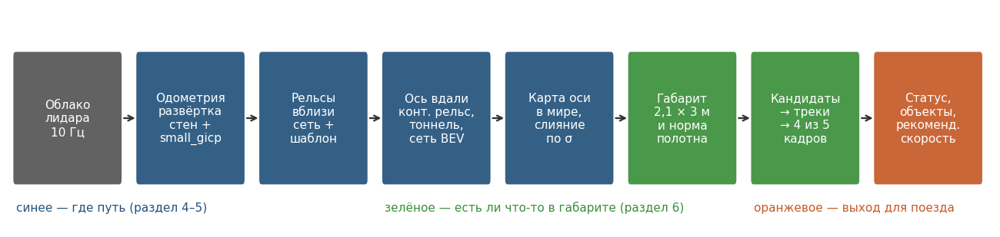

---

## 1. Задача и данные

### 1.1. Что было на входе

| Запись | Длительность | Кадров | Особенности |
|---|---|---|---|
| `new_data` | 20 мин | 11 271 | около 14 км маршрута; ближе к концу обрывы записи |
| `cloud_with_fake_obj` | 2,5 мин | 1 510 | проезд с синтетическими препятствиями |
| `cloud_clean` | 2,5 мин | 1 500 | **чистый проезд мы сделали сами** из `cloud_with_fake_obj`: вырезали вставленные точки, вернули облако в сетку колец и восстановили поля `ring` и `timestamp` (`scripts/clean_fake_bag.py`) |
| 6 коротких записей `for_hackathon` | 20–88 с каждая | 2 488 | станции, стрелки, гермозатворы, круглые и прямоугольные тоннели |
| `doubleT_obstacle` (из них) | 20 с | 201 | поезд стоит, настоящий человек и предмет на рельсе; другой драйвер (920 тыс. точек в кадре) и другая установка лидара |

Во всех записях есть только один топик, облако лидара. **Нет ни скорости поезда, ни одометрии,
ни положения на маршруте, ни карты пути, ни разметки.** Всё это пришлось восстанавливать
из самого облака: одометрию, карту и разметку для обучения мы вычисляем сами.

### 1.2. Почему данные трудные

**Облако разреженное, и вдали оно почти пустое.** У лидара 128 колец, шаг 0,1° по горизонтали и
0,125° по вертикали в плотной зоне. На 150 м соседние лучи расходятся на 26 × 33 см, на 300 м
на 52 × 65 см. Головка рельса имеет высоту 7 см и уже на средних дальностях теряется между
лучами. Полотно пути лидар видит под скользящим углом. Уже на 100 м полоса пути длиной 2 м
содержит хотя бы 5 точек только в 15 % кадров, а на 110–120 м около 5 % (рисунок ниже, справа).

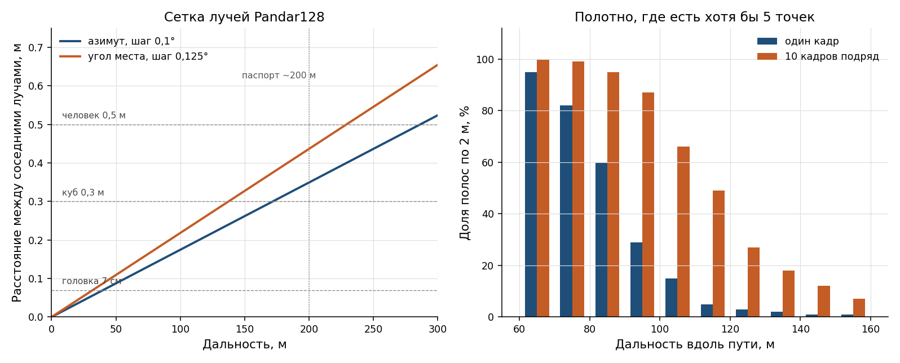

**Обнаружение на 300 м на этих данных физически недостижимо.** Причин три:

1. **Паспортная дальность лидара около 200 м.** В записях нет ни одной настоящей точки дальше
   209 м.
2. **Полотно попадает под лучи редко.** На прямом ровном пути между 150 и 300 м полотна
   касаются всего два кольца, на 181 и 271 м. Человек на 300 м получает 1–3 точки за кадр.
3. **На кривой обзор закрывает стена тоннеля.** Прямая видимость на кривой радиуса R
   примерно равна 2√(2·R·m), где m — расстояние от лидара до стены. При m = 2 м видимость
   100 м получается при R ≈ 600 м, 150 м при R ≈ 1400 м, а 300 м только при R больше 5 км.
   В реальном кадре на кривой последнее кольцо, которое касается полотна, лежит на 77 м.

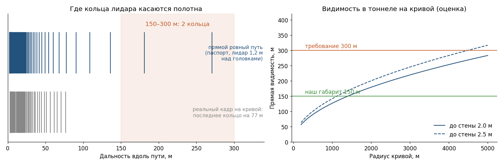

Поэтому мы поставили целью **честные 150 м**: габарит проверяется до тех пор, пока путь реально
виден. Дальше система не выдумывает путь, а сообщает, докуда его видит, и снижает
рекомендуемую скорость. При экстренном торможении 1,3 м/с² и реакции 1 с проверенные
150 м позволяют ехать около 65 км/ч (для 300 м было бы около 95 км/ч).

**Проблемы в записях.**

- **`new_data` ближе к концу рвётся.** Первые 13 минут записаны без пропусков. Дальше идут
  46 разрывов длиннее 0,2 с, самые длинные до 7 с, всего теряется около 87 с. После разрыва
  тракт сбрасывает одометрию и накопление и набирает их заново за несколько кадров. При
  обучении сетей такие участки исключены.
- **В `cloud_with_fake_obj` объекты вставлены некорректно**, и по ним можно отличить
  синтетику от настоящих точек, вообще не решая задачу:

  | Признак | Настоящие точки | Вставленные объекты |
  |---|---|---|
  | Интенсивность | медиана 8, значение ровно 1 у 4 % точек | ровно **1** у всех точек |
  | Место в облаке | сетка 128 колец × 2400 колонок | **дописаны в конец**, без полей `ring` и `timestamp` |
  | Дальность | не дальше 209 м | до **300 м**: в 301 кадре есть «объекты» дальше 200 м, чего лидар не видит |

  Фильтр вида «интенсивность = 1» находит такие объекты безошибочно, но на настоящем поезде он
  бесполезен. Мы эти артефакты как признаки не используем. Дальность обнаружения меряем на
  собственном стенде, где объекты вставляются по лучам лидара, с реалистичной интенсивностью
  и тенью (раздел 8). Чтобы эта запись проходила через тракт, перемешанное облако
  раскладывается обратно в сетку колец (`fod/organize.py`).
- **`doubleT_obstacle` снят с другой установкой лидара**: головки рельсов на 0,45 м ниже,
  облако наклонено на 1,6 %. Это хорошая проверка переносимости, и она пригодилась (раздел 5.5).

---

## 2. Как представлять облако

Обычный путь для 3D-детекции — нейросеть прямо по точкам (PointNet, voxel-сети). Здесь он
не работает по двум причинам:

- **В «мешке точек» теряется соседство.** Для разреженного лидара соседство точек в пространстве
  случайно, а соседство по лучам (кольцо и колонка) стабильно и несёт смысл: какой луч
  упёрся в предмет, а какой прошёл дальше.
- **Объекты вдали — это несколько точек.** Учить классификатор «что это за предмет» по 3–10 точкам
  нельзя, а размеченных примеров препятствий в данных нет вовсе.

Поэтому каждое облако мы смотрим в нескольких представлениях, у каждого своя задача:

| Представление | Что это | Зачем |
|---|---|---|
| **Range image** (развёртка лидара) | картинка 128 колец × колонки по азимуту, в пикселе дальность, высота и интенсивность | родная сетка сенсора, соседство без потерь; по ней работает сеть рельсов вблизи |
| **Развёртка стен тоннеля** | стена в координатах «вдоль пути × угол по сечению», значение — интенсивность | текстура стен (кабели, стыки, кронштейны); по её сдвигу между кадрами мы сами считаем одометрию, которой в данных нет |
| **Выпрямленный вид сверху** | точки в координатах вдоль и поперёк текущей оси, 10 кадров накоплены по нашей одометрии | вдали в одном кадре почти пусто, в накопленном виде путь уже читается; по нему работает дальняя сеть |
| **Координаты пути (s, n, u)** | расстояние вдоль оси, смещение от оси, высота над головками рельсов | в них габарит — простой прямоугольник, а «норма полотна» не зависит от кривых и уклонов |

Все четыре представления для одного кадра `roundT_doubleT`:

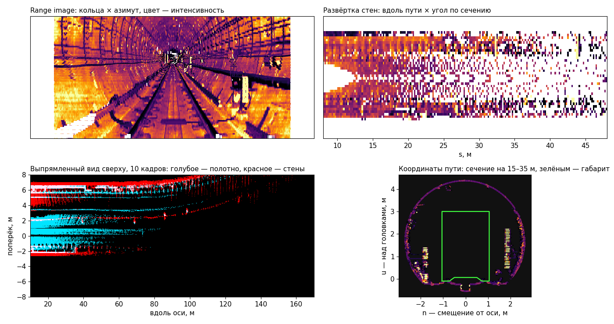

---

## 3. Концепция решения

Возможны два подхода.

**A. Через карту маршрута.** Один раз проехать маршрут, собрать облако всего тоннеля, разметить
рельсы и коридор, построить карту «как выглядит пустой тоннель». В поездке определять своё место
на карте и тревожить на всё, чего на ней нет. Так точнее всего, особенно вдали и на стрелках.
Но для этого нужны повторные проезды одного перегона, положение поезда на маршруте и данные о
стрелках. Таких данных нет, а система должна работать и на незнакомых записях.

**B. По тому, что видно сейчас.** В каждом кадре заново найти рельсы, построить ось пути и
габарит поезда и проверить, есть ли в габарите точки выше нормального полотна. Здесь всё
решает качество оси: ошибка оси на 20 см вдали — это либо ложная тревога от стены, либо
пропущенный объект у края.

**Мы выбрали B**: он работает на любой записи без подготовки. Задел для A тоже сделан и показан
в разделе 9: система уже строит карту маршрута по одометрии и карту «высоты над нормой».

---

## 4. Одометрия: где поезд и как он движется

### Зачем она нужна

- **Компенсация движения за оборот лидара.** При 60 км/ч за один оборот (0,1 с) поезд проезжает
  1,7 м, и без поправки облако «размазано».
- **Накопление кадров вдали.** Дальняя сеть смотрит на 10 кадров, сложенных в одной системе
  координат.
- **Ось пути и треки препятствий хранятся в мире.** Тогда габарит не дрожит от кадра к кадру,
  а неподвижный предмет остаётся в одном месте и подтверждается по нескольким кадрам.
- **Карта и автоматическая разметка для обучения сетей** (раздел 5.3).
- **Скорость поезда** нужна для рекомендуемой скорости и тормозного пути.

### Как считают одометрию по лидару

Если других датчиков нет, движение находят **выравниванием сцен**. Берут текущее облако и ищут
такой поворот и сдвиг, при котором оно лучше всего совпадает с предыдущим облаком или с картой
из нескольких последних кадров. Найденное преобразование и есть перемещение поезда за кадр,
а сумма таких шагов — траектория.

Стандартный инструмент для этого — **ICP** (Iterative Closest Point). Для каждой точки текущего
облака ищется ближайшая точка в эталоне; по этим парам вычисляется поворот и сдвиг, уменьшающий
расстояния; облако сдвигается, и всё повторяется, пока ответ не перестанет меняться. В
улучшенных вариантах (point-to-plane, GICP) точку сравнивают не с точкой, а с локальной
поверхностью. Мы используем small_gicp, быструю реализацию GICP.

### Почему в тоннеле ICP ошибается

- **Тоннель вырожден вдоль оси.** Это длинная однородная труба: облако можно сдвинуть вдоль
  самого себя, и совпадение почти не ухудшится. На наших записях свободный point-to-plane ICP
  между соседними кадрами давал −0,71 м вместо реальных +1,54 м.
- **Без начального приближения ICP может не сойтись.** ICP — локальный метод: он находит
  правильный ответ, только если начинает рядом с ним. При 55 км/ч поезд за кадр проезжает
  1,5 м; если стартовать с нуля или с неверной скорости, ICP сходится к ложному ответу или не
  сходится вовсе. small_gicp с моделью постоянной скорости первые 3,5 с показывает, что поезд
  стоит, затем выбрасывает скорость до 72 км/ч и занижает пройденный путь на 12 % (красная
  линия на рисунке ниже).
- **На пропусках кадров ошибки тоже возможны.** Если запись прервалась на несколько секунд,
  поезд успевает уехать на десятки метров, и никакое приближение «как в прошлом кадре» уже не
  годится. Поэтому при разрыве дольше 0,55 с тракт сбрасывает одометрию и накопление и
  начинает заново, а в разметку для обучения такие участки не берутся.

### Что сделали: одометрия по осям плюс уточнение ICP

Каждую степень свободы мы меряем тем признаком, который её хорошо определяет:

- **Путь вдоль тоннеля — по развёртке стен.** Стена раскладывается в картинку «вдоль пути ×
  угол по сечению», и сдвиг между кадрами находится фазовой корреляцией (две верхние панели:
  текстура сдвигается к поезду на пройденный путь). Кадр сравнивается не только с предыдущим,
  но и с кадрами трёх и шести шагов назад: на длинной базе шум одного сопоставления весит
  меньше. Результат проходит через фильтр Калмана с моделью «поезд едет вперёд или стоит» и
  ограничением ускорения 1,3 м/с².
- **Поворот и боковой снос — по профилю стен.** Кромки сечения тоннеля на 12–95 м дают курс.
  На короткой базе поворот путается с раскачкой кузова на рессорах, поэтому база длинная.
- **Это начальное приближение для small_gicp** (облако к локальной воксельной карте). Оно
  убирает вырождение и ставит ICP рядом с правильным ответом, а ICP уточняет все шесть
  степеней свободы. Время 9 мс на кадр в 4 потока.

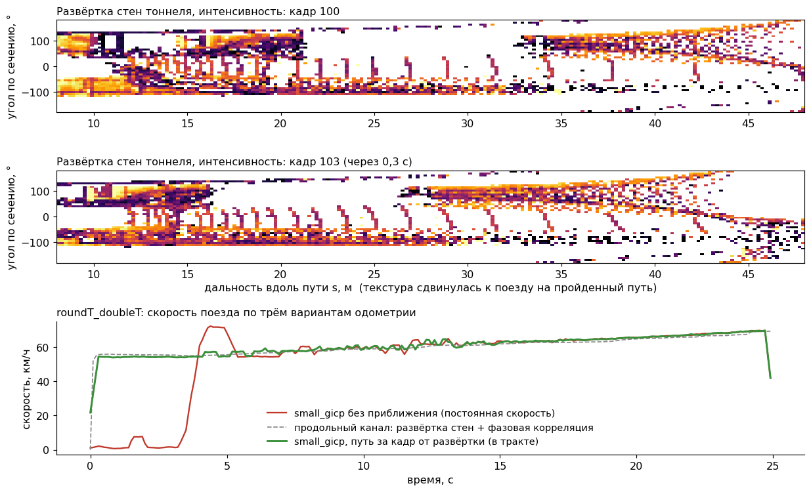

С начальным приближением (зелёная линия) скорость гладкая с первого кадра, а путь совпадает
с продольным каналом (421,7 м против 422,5 м за 25 с). По той же цепочке строится карта всех
14 км `new_data` (раздел 9).

---

## 5. Рельсы, ось пути и габарит

### 5.1. Вблизи: шаблон пары головок

Сначала мы измерили, как рельсы выглядят в данных. Центры головок стоят на 1,56–1,66 м друг
от друга (колея 1520 мм плюс ширина головки). Головка поднята над окружением на 9–18 см.
Главный признак — **интенсивность: на головке она ниже, чем на полотне вокруг**. Гладкая
стальная головка отражает луч зеркально, в сторону, и к лидару возвращается слабый сигнал. По
разметке сети: медиана интенсивности на головке 2, на полотне рядом 7–8; вблизи головка темнее
окружения в 85–91 % случаев, на 40–70 м в 69 %. На всех картинках развёртки цвет идёт от
тёмного (низкая интенсивность) к светлому (высокая), поэтому рельсы и выглядят тёмными линиями.
Этот признак держится до 50–65 м, когда подъём по высоте уже не различить.

Отсюда согласованный фильтр «пара головок». Он идёт по полосам дальности от поезда вдаль:
2 м между станциями у поезда, 4 м к 60 м. Каждую следующую пару он ищет по продолжению уже
найденной оси (прямая, парабола или кубика по числу найденных пар), а между кадрами ось держит
фильтр Калмана. На рисунке жёлтым — найденные пары головок и линии шаблона между ними, зелёный
пунктир — ось; сверху вид спереди, снизу вид сверху до 60 м.

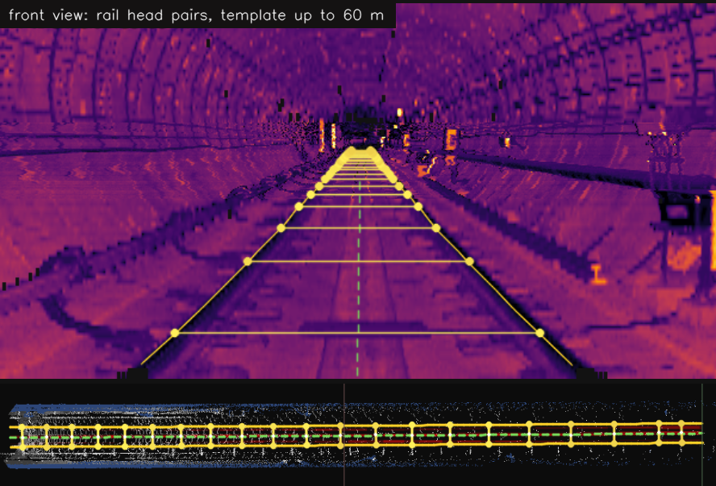

Вблизи шаблон надёжен и точен до сантиметров. Дальше 50–60 м головки теряются, и дотянуть
ось дальше 60–80 м он не может.

### 5.2. Вдали: геометрии не хватает, нужно машинное обучение

Сначала мы попробовали продлить ось без обучения:

- **Профиль тоннеля.** Вблизи, где ось точная, запоминается поперечное сечение тоннеля (стены,
  лотки, кабели). Вдали ищется сдвиг среза, при котором он лучше всего ложится на это сечение.
  В медиане ось дотягивает только до 80–100 м, ошибка на 90–150 м 8–15 см, а за 110 м
  пригодных срезов почти нет.
- **Контактный рельс.** Его короб стоит в 1,41 м от оси (±2 см на всех записях) и заметен
  лучше головок. Следя за ним, мы продлили ось примерно до 120 м, но только там, где он есть
  и виден.

Оба источника оставлены в тракте как дополнительные свидетельства, но до 150 м стабильно не
дотягивает ни один из них. Главная причина в том, что **геометрия тоннеля всё время разная**:
круглые и прямоугольные тоннели, платформы станций, гермозатворы, двухпутные участки,
стрелки, ниши и оборудование на стенах. Под каждый случай нужно своё правило, а в незнакомом
тоннеле правило ломается. Вдали же путь виден только как совокупность слабых признаков: редкие
точки полотна, стены, контактный рельс, форма всего коридора. Собрать такие признаки и
выучить их закономерности на разных типах тоннелей может только модель машинного обучения.

### 5.3. Откуда карта и разметка

Для обучения нужны разметка и данные в одной системе координат, и **оба дала наша одометрия**:

- **Карта.** Позы по всей записи сводят кадры в общий мир. Ниже фрагмент такой карты
  (`roundT_doubleT`, 3 см на пиксель, вид сверху): видны шпалы, соседние пути, край платформы
  и ниши; зелёная линия — траектория поезда.

  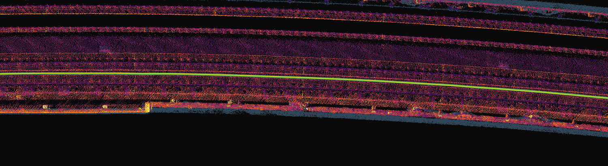

- **Разметка «из будущего».** Через несколько секунд поезд проедет место, которое сейчас
  лежит на 150 м, и увидит его вблизи, где шаблон точен. Траектория поезда по карте и есть
  ось пути; смещение лидара от оси берём по контактному рельсу, а высоту и боковую поправку
  уточняем шаблоном головок в ближней зоне. Эту ось переносим назад в систему текущего кадра
  и получаем эталон до 150 м **без ручной разметки**.

Участки с разрывами записи и кадры, где шаблон вблизи не подтвердил эталон, отбрасываются.
Обучаем на `new_data` и `cloud_clean`, а проверяем на пяти других записях, которых сеть не видела.

### 5.4. Две сети

**Обе архитектуры наши, а не готовые модели.** Готовые сети для лидара (PointNet, воксельные
детекторы, сегментаторы range image) рассчитаны на другие задачи и другие входы: автомобильные
датчики, классы «машина / пешеход», готовые наборы данных. Здесь вход особый: у range image всего
128 строк, головка рельса занимает 1–3 пикселя, а вид сверху выпрямлен вдоль оси пути и тянется
на 160 м. Поэтому сети спроектированы под эти входы и выходы сами: как сжимать по кольцам и по
азимуту, как перекрывать провалы данных вдоль пути, что выдавать (распределение положения оси
вместе с σ). Из известных работ взята только общая идея остаточных блоков с расширенными
свёртками, как в SalsaNext. Обе сети обучены с нуля, без предобученных весов.

| | Сеть вблизи (`RailSegNet`) | Сеть вдали (`FarBevNet`) |
|---|---|---|
| Задача | найти пиксели левой и правой головки и контактного рельса | продолжить ось вбок и по высоте до 150–170 м |
| Вход | range image 128 колец × 1200 колонок (сектор 120° вперёд): дальность, высота, интенсивность, маска, координаты | выпрямленный вид сверху: 10–170 м через 0,5 м, ±8 м через 0,1 м; 6 слоёв высоты, интенсивность, высота низких и верхних точек; 1 или 10 кадров |
| Архитектура | своя: энкодер-декодер из остаточных блоков с расширенными свёртками; по кольцам сжатие только в 4 раза (колец всего 128), по азимуту в 16; skip-связи сохраняют головки шириной 1–3 пикселя | своя: энкодер-декодер из тех же блоков; в узком месте свёртки, расширенные вдоль пути, перекрывают провалы данных в десятки метров |
| Выход | 4 класса на пиксель | на каждые 2 м пути распределение по 160 боковым ячейкам по 0,1 м плюс σ; поправка высоты с масштабом (распределение Лапласа) |
| Параметров | 3,2 млн | 5,0 млн |
| Данные | 11,1 тыс. кадров обучения, 2,0 тыс. проверки | 6,7 тыс. / 1,5 тыс. |
| Обучение | кросс-энтропия с весами классов + Dice; случайный кроп по азимуту, зеркало с обменом левой и правой головки | кросс-энтропия по ячейкам + L1 + гладкость; зеркало, сдвиг оси выпрямления, чтобы сеть не повторяла её; 20 эпох, 16 мин |
| Качество на проверке | IoU: головки 0,98 / 0,98, контактный рельс 0,93 | ошибка оси на 120–140 м (p90): вбок **19 см**, по высоте **15 см**; без сети (продолжение оси) 146 и 57 см |

**Сети не заучили конкретные проезды, а обобщают.** Все цифры качества в таблице получены на
пяти записях, которых сети не видели при обучении: это другие участки, станции, стрелки,
гермозатворы, круглые и прямоугольные тоннели. Здесь была ловушка: сегменты `new_data` — это
повторные проезды одного маршрута, и проверка на соседних кусках той же записи мерила бы память
сети, а не обобщение (профили кривизны разных сегментов совпадают с корреляцией 0,95). Поэтому
проверку мы ведём только на других записях. Обучающих данных пока немного: по сути один
маршрут длиной 14 км, 11 тыс. кадров для сети вблизи и 6,7 тыс. для сети вдали. С записями
других линий и типов тоннелей сети станут точнее и увереннее вдали, а готовить их для этого
почти не нужно: разметка строится автоматически по одометрии и шаблону (раздел 5.3).

Выход дальней сети — распределение, а не одно число, по двум причинам. На стрелке у пути две
ветки, и распределение держит обе, а не усредняет их в несуществующую середину. А σ честно
растёт там, где не видно ничего, и тракт знает, где сети можно верить.

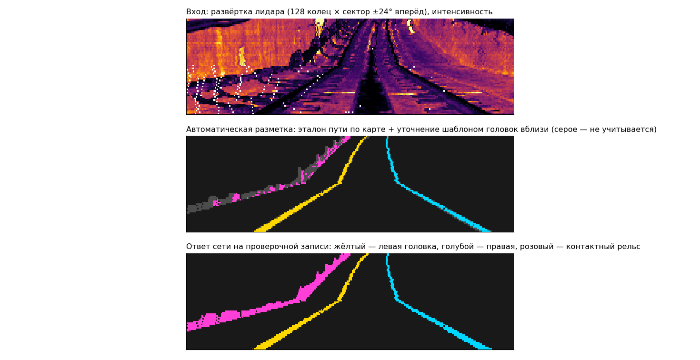

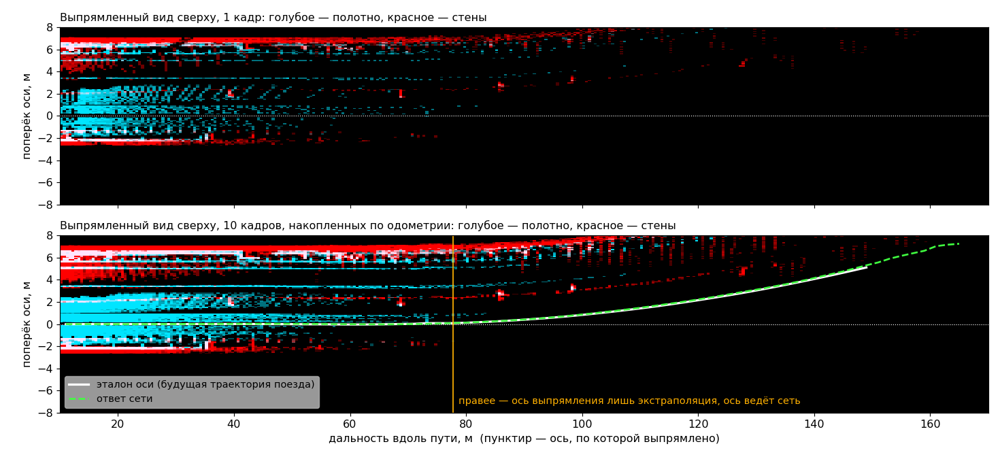

### 5.5. Слияние: сети добавляют уверенности, но не заменяют геометрию

Ось собирается из всех источников (шаблон, сеть вблизи, контактный рельс, профиль тоннеля,
дальняя сеть) с весами по их σ и хранится **в мировых координатах**. Каждый кадр её уточняет,
а не строит заново. Поэтому вблизи ось почти неподвижна (на 20 м точка оси смещается между
кадрами меньше чем на 1 см), а вдали плавно следует за новыми измерениями.

Сети — усилитель, а не единственный источник:

- **На `doubleT_obstacle` (другая установка лидара) сеть вблизи не находит головок вовсе**: она
  видит абсолютную высоту точки, а головки там на 0,45 м ниже. Если сеть три кадра подряд даёт
  меньше четырёх пар, включается шаблон. Он находит 18–20 пар в каждом кадре, и тракт работает.
- **Дальняя сеть используется только там, где её σ мала.** Где она не уверена, путь известен
  ближе, и детектор честно проверяет габарит на меньшей дальности, а не выдумывает его.

**Дальность.** Габарит проверяется **максимум до 150 м** (ограничение в настройках детектора:
дальше ошибка оси уже сравнима с шириной габарита). Сама ось известна чуть дальше: в медиане до
154 м, до 140 м она есть в 81 % кадров, ошибка на 120–140 м (p90) вбок 13 см и по высоте 12 см.
Без дальней сети было бы 80–100 м.

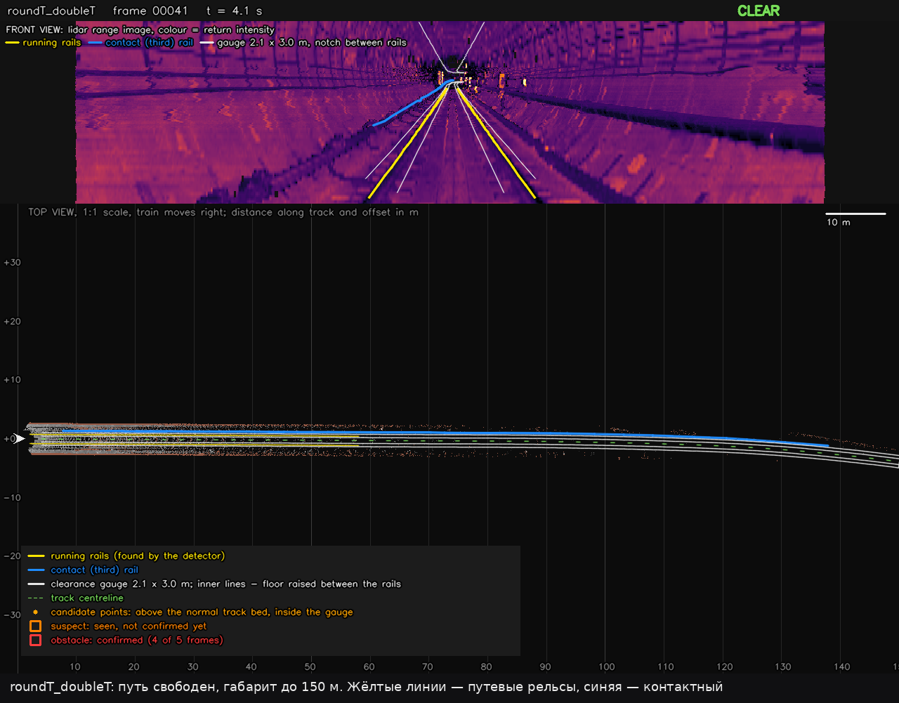

---

## 6. Обнаружение препятствий

1. **Габарит.** Вокруг оси строится коридор ±1,05 м по ширине и 3 м по высоте над головками
   рельсов, от 4 до 150 м. Его дно лежит на 10 см ниже головок, а между рельсами поднято на
   6 см выше головок (вырез). Предмет на рельсе или низкий предмет у края попадает в габарит,
   а табличка или крепление на полотне между рельсами не попадает.

   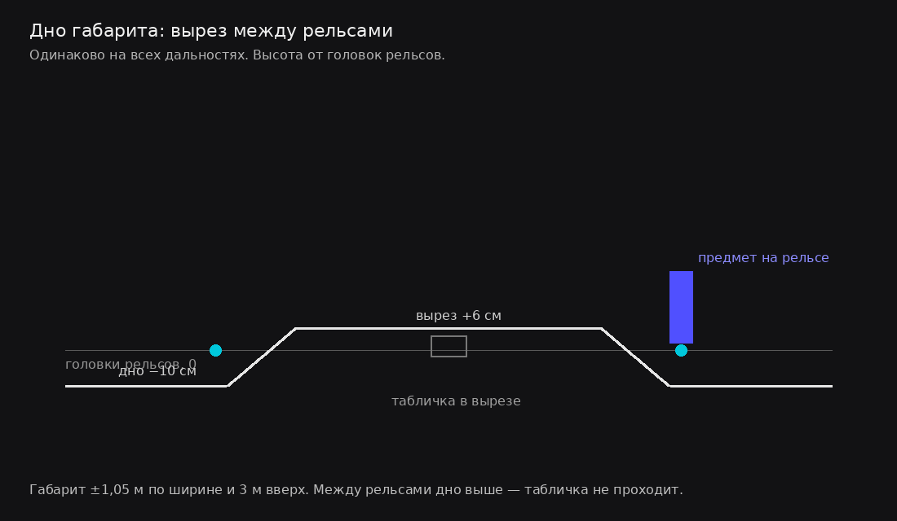

2. **Норма полотна.** Для каждой полосы поперёк пути система запоминает обычную высоту полотна
   (шпалы, лотки, крепления) по ближней зоне 4–25 м, где данные плотные, как медиану по
   последним кадрам. Когда поезд стоит, норма не обновляется: иначе появившийся впереди
   предмет через несколько секунд стал бы «полотном».
3. **Кандидаты.** Точка в габарите, которая выше нормы на порог. До 60 м порог растёт
   полого (12 см на 56 м), дальше круто (44 см на 100 м), потому что вдали растёт ошибка оси
   и нормы. Вдали габарит ещё и немного сужается, чтобы ошибка оси не задевала стены.

   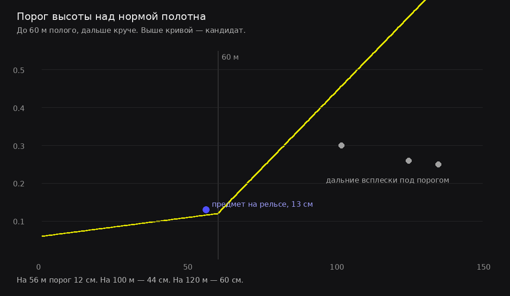

4. **Треки, ВНИМАНИЕ и подтверждение.** Кандидаты склеиваются в группы и ведутся в мировых
   координатах. Как только группа попала в габарит хотя бы дважды, выдаётся уровень
   **ВНИМАНИЕ**, а препятствие **подтверждается**, если группа держится на одном месте в
   4 кадрах из 5. ВНИМАНИЕ может появиться на любой дальности габарита, то есть до 150 м.
   Между ВНИМАНИЕМ и подтверждением проходит от 4 кадров, а у далёких и мелких объектов,
   которые видны не в каждом кадре, дольше; за это время поезд проезжает от нескольких метров
   до нескольких десятков метров (по стенду в медиане 5–12 м, таблица в разделе 7).

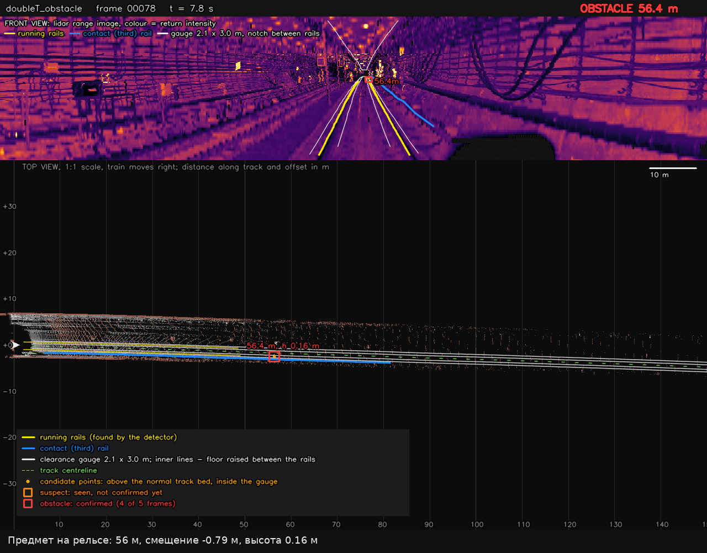

**Что попробовали и отбросили:**

- **Аномалии прямо на range image** (разность локальных медиан дальности). Они реагируют на
  любую структуру тоннеля: кабели, ниши, светильники. Отделить от них препятствие без знания
  пути нельзя. Сравнение на рисунке ниже: только «выше нормы и внутри габарита» оставляет
  один объект.
- **Один наклон порога на все дальности.** Он не разделяет предмет 13 см на рельсе на 56 м и
  ложные всплески 25–30 см на 100–140 м. Отсюда порог с изломом на 60 м. На том же стенде
  (22 минуты чистых записей) последние версии давали 4 ложных объекта, все на 60–150 м.
  После излома порога и выреза в дне габарита их стало 0, а предмет на рельсе в
  `doubleT_obstacle` по-прежнему подтверждается.
- **Надбавка к порогу между рельсами** вместо выреза в дне: она прятала и предметы на рельсах.
- **Подтверждение по времени, а не по кадрам.** Куб находился на 4 м дальше, но ложных
  тревог становилось в 1,5–2,5 раза больше.
- **Обновление нормы на стоянке.** Куб 0,3 м держался в тревоге только 13 % времени, а после
  «заморозки» нормы держится 100 %.

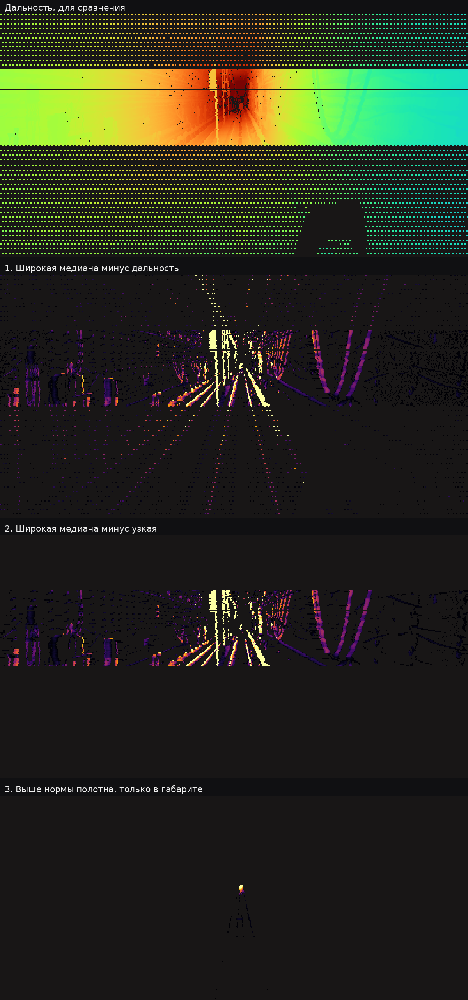

---

## 7. Результаты и быстродействие

### Дальность и ложные тревоги

Объекты вставлялись стендом (раздел 8) в настоящие записи на ось пути, поезд подъезжал к ним
55 раз. Ложные тревоги считались на тех же записях без объектов и на 20 минутах `new_data`.

| Объект на оси пути | Первый луч | ВНИМАНИЕ | Подтверждение | Разрыв ВНИМАНИЕ → подтверждение | Пропуск |
|---|---|---|---|---|---|
| Человек | 155 м | 137 м (до 150 м) | **114 м** (в 45 % подъездов дальше 120 м) | 12 м (4–40 м) | 0 % |
| Щит 2 × 1,9 м | 155 м | 149 м | **129 м** | 5 м (4–39 м) | 0 % |
| Ящик 0,5 м | 145 м | 91 м | **85 м** | 5 м (4–34 м) | 0 % |
| Куб 0,3 м | 119 м | 82 м | **70 м** | 11 м (4–30 м) | 0 % |
| Плоский предмет 0,3 × 0,3 × 0,1 м между рельсами | 119 м | 40 м | не подтверждается | — | 100 % |

Все значения — медианы по 11 подъездам на объект, в скобках разброс. Объект появляется в 155 м
впереди, поэтому «первый луч» не больше 155 м. Плоский предмет высотой 10 см, лежащий на полотне
между рельсами, ниже поднятого дна габарита (+6 см над головками) и отсекается так же, как
табличка или крепление: это осознанная цена за отсутствие ложных тревог. Предмет той же высоты
на рельсе или у края габарита попадает в габарит (как настоящий предмет 16 см в `doubleT_obstacle`).

Ложные тревоги на чистых записях: **0 за 22,3 минуты** — ни одного подтверждённого объекта и ни
одного кадра со статусом ПРЕПЯТСТВИЕ.

**Настоящие объекты в `doubleT_obstacle`** (поезд стоит): человек, переходящий путь, подтверждён
на 56 м, и предмет высотой 16 см на рельсе на той же дальности; оба держатся всё время, пока
находятся в габарите.

**Запись `cloud_with_fake_obj`.** Подтверждено 9 объектов, щит — с 98 м, то есть сразу, как
только он появляется в записи. Два объекта не видны по построению: они стоят левее габарита
(1,1–1,4 м и 2,4 м от оси). Габарит можно расширить на высоте кузова (раздел 9).

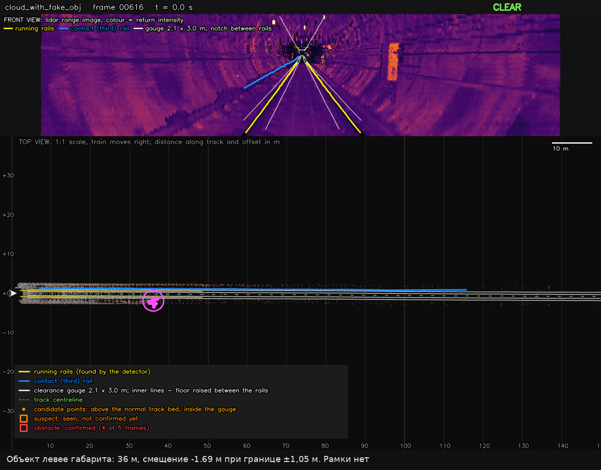

### Быстродействие

Ноутбук RTX 5080 Laptop + Core Ultra 9 285H: **75–90 мс на кадр** (медиана), p95 около 105 мс.
Тракт разбит на три потока: чтение и развёртка → одометрия и сеть рельсов → ось и детектор.
Самые тяжёлые этапы: развёртка тоннеля около 36 мс (в фоне), small_gicp около 21 мс (в фоне),
контактный рельс около 25 мс. Обе сети вместе занимают около 18 мс, поэтому перевод в ONNX или
TensorRT заметного выигрыша не даст: время уходит на подготовку данных, и её мы уже перенесли
на видеокарту.

На `doubleT_obstacle` (920 тыс. точек в кадре) выходит 160–200 мс. Если тракт не успевает,
узел всегда берёт самый свежий кадр, и отставание не копится.

---

## 8. Стенд-синтезатор препятствий

В данных нет ни одной записи, где поезд подъезжает к настоящему предмету издалека, а
синтетика в `cloud_with_fake_obj` некорректна (раздел 1.2). Без своего стенда дальность
обнаружения измерить нельзя, поэтому мы сделали его.

**Как он вставляет объект.** Для каждого луча настоящего кадра проверяется, пересекает ли он
объект. Если объект ближе, чем то, во что луч попал, точка заменяется точкой на объекте:
с шумом дальности 2 см, двумя возвратами луча и интенсивностью как у поверхностей тоннеля с
учётом угла падения. Лучи за объектом пропадают, поэтому объект даёт настоящую тень. В
результате получается то облако, которое лидар выдал бы с этим предметом на пути.

**Что задаётся.** Сценарий в YAML: тип и размер объекта (человек, ящик, куб, бочка, конус,
провод, шар или копии объектов из `cloud_with_fake_obj`), где он стоит (метр пути или «всегда
N м впереди»), смещение от оси, высота. **Что выдаёт:** для каждого подъезда — на каком
расстоянии в объект впервые попал луч, когда появилось ВНИМАНИЕ, когда пришло подтверждение и
сколько времени тревога держалась; отдельно ложные тревоги; видео.

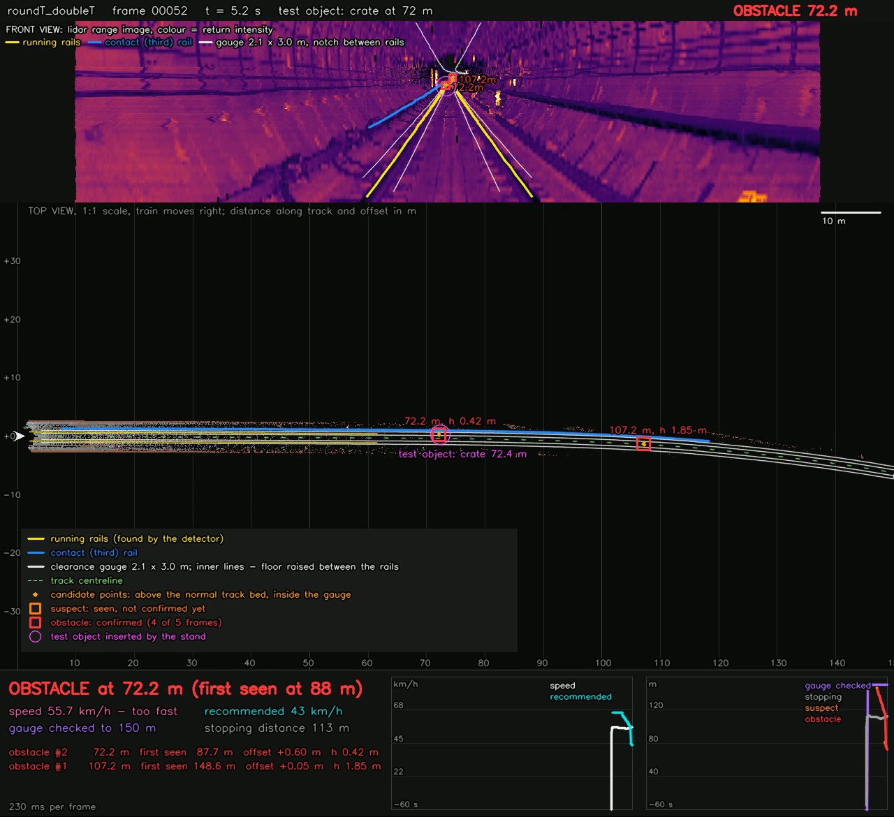

Пример сценария на `roundT_doubleT`:

| Объект | Первый луч | ВНИМАНИЕ | Подтверждение | Держалось |
|---|---|---|---|---|
| Человек на оси | 155 м | 147 м | 144 м | 100 % |
| Щит 2 × 1,9 м | 136 м | 123 м | 101 м | 100 % |
| Ящик 0,5 м, 0,6 м от оси | 119 м | 82 м | 77 м | 100 % |

Запуск: `./run_tool.sh stand <запись> --scenario сценарий.yaml --video`.

---

## 9. Что можно сделать дальше

### Улучшить детекцию

- **Проверка тени.** За настоящим объектом лидар не видит пол и стену, а у табличек и мусора
  на полотне тени почти нет. Этот признак считается прямо по range image.
- **Классификатор кандидатов.** Лёгкая модель (градиентный бустинг) на признаках трека: размер,
  высота, устойчивость положения в мире, тень, контраст интенсивности. Учить можно на объектах
  со стенда против ложных кандидатов, которые детектор находит до порога на чистых записях.
- **Ширина габарита по высоте.** Вагон шириной около 2,7 м: внизу оставить ±1,05 м (лотки,
  короб контактного рельса), а выше 0,5 м над головками расширить до ±1,45 м.

### Карта маршрута (подход A) уже возможна

Одометрия строит карту записи: облако в мире (`map.ply`, `map.pcd`), вид сверху плитками по
100 м (3 см на пиксель), траекторию и места препятствий. Команда: `./run_tool.sh map <запись>`.
Ниже — траектория 14 км `new_data`, построенная одной цепочкой одометрии, и плитка карты
`roundT_doubleT` (200–300 м записи).

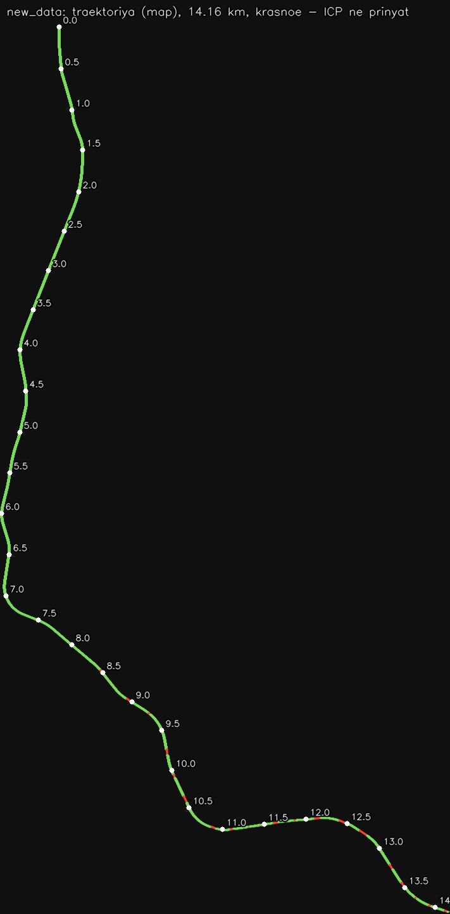

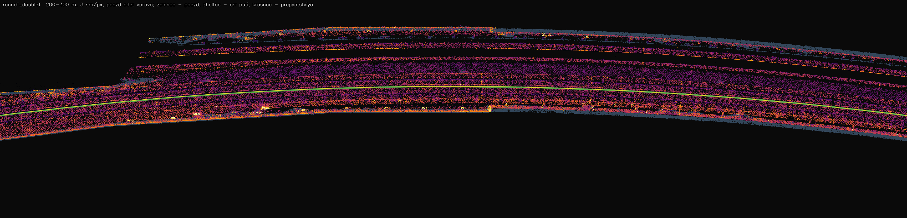

На такой карте можно один раз разметить путь (тем же шаблоном и сетями) и в поездке
сравнивать текущий кадр с «пустым тоннелем». Всё новое в габарите подозрительно, и работает
это вдали лучше онлайн-подхода. **Для стрелок и развилок нужны данные от поезда**: маршрут и
положение стрелок. Лидар видит обе ветки, но не знает, на какую свернёт поезд.

### Что уже считается и может использоваться

- **Рекомендуемая скорость.** Поезд должен успеть остановиться до конца проверенного габарита
  или до препятствия: v·t + v²/(2a) = D − запас. Параметры по умолчанию: замедление 1,3 м/с²,
  реакция 1 с, запас 5 м; все настраиваются. Выдаётся вместе с тормозным путём, превышение
  скорости отмечается отдельным флагом.
- **Карта аномальности**: высота каждой точки над нормой полотна. Сейчас она видна в
  просмотрщике rerun, и её можно копить по маршруту для той же карты «пустого тоннеля».
